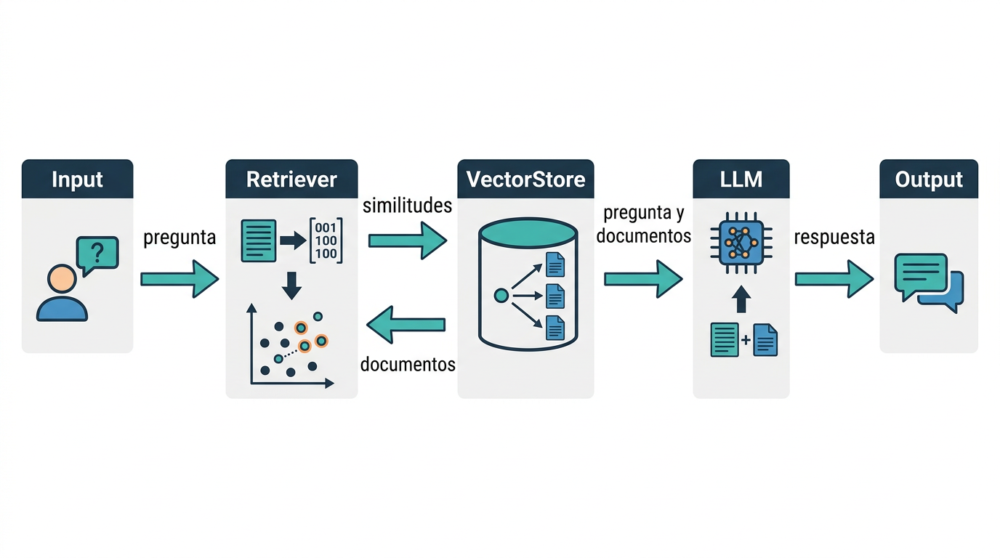
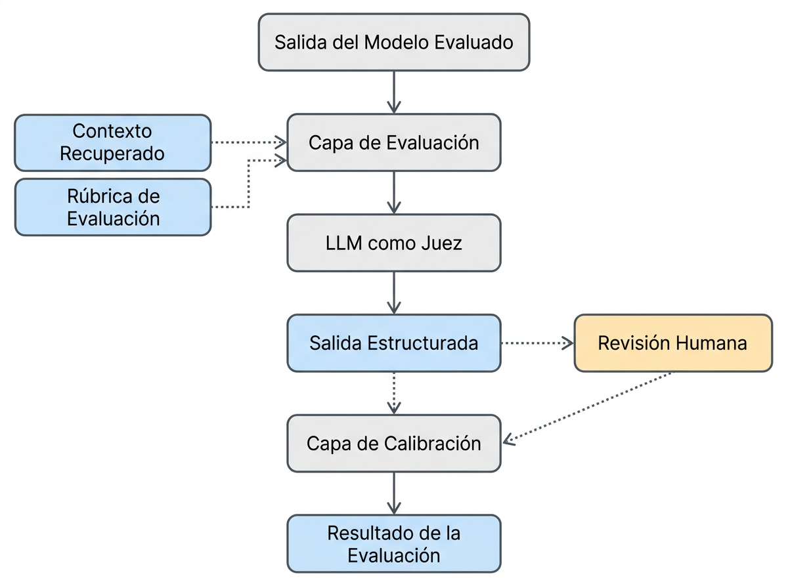

# ¿Cómo sabes que tu RAG funciona?
## Métricas de evaluación desde cero

Juan Manuel Carballo · github.com/jmanuelc87

---

## Construir un RAG toma una tarde; saber si responde bien, no

Retrieval Augmented Generation (RAG) es un patrón que conecta un LLM con una fuente de datos externa: un retriever busca contexto relevante y el LLM genera la respuesta con eso.

<center>

</center>

- Tienes retriever + vector store + LLM. Responde.
- ¿Responde **con lo que recuperó** o con lo que ya sabía?
- ¿Cómo lo mides en 500 preguntas sin leerlas todas?

---

## Un LLM-as-a-Judge es un modelo que califica a otro… con reglas explícitas

Un LLM-as-a-Judge no es "pregúntale a un modelo si está bien": es un patrón con piezas concretas.

- **Entradas:** salida evaluada + contexto recuperado + rúbrica de evaluación
- **Salida:** JSON parseable (score + justificación) — apto para ser leído por una máquina
- Después del juez: revisión humana y una **capa de calibración**
- Se calibra con técnicas de prompt y, cuando hay acceso al modelo, con clasificadores (ver más adelante)

---

<center>

</center>

---

## Tres formas de pedirle un veredicto al juez

Faithfulness usa veredictos binarios por afirmación, no una escala 1–5.

| Tipo                | Qué recibe el juez   | Qué devuelve  | Uso típico       |
| ------------------- | -------------------- | ------------- | ---------------- |
| Pairwise            | dos respuestas       | cuál es mejor | A/B de modelos   |
| Pointwise           | pregunta + respuesta | escala (1–5)  | calidad general  |
| **Binario (sí/no)** | una afirmación       | sí / no       | **faithfulness** |

---

## Faithfulness: ¿la respuesta está sostenida por el contexto recuperado?

- Faithfulness ∈ [0, 1]
- 1.0 → toda la respuesta se deriva del contexto
- Penaliza lo que la respuesta agrega o desvía del contexto recuperado
- **No** mide si la respuesta es correcta: mide si es fiel a lo recuperado
- La definición es la misma en RAGAS y DeepEval; **el cálculo no**

---

## RAGAS: cada afirmación debe estar *soportada* por el contexto

```
INPUT:
  q   : question           (string)
  a   : answer/output      (string)
  c   : context = passages (list[string])
  LLM : judge model
OUTPUT:
  F   : faithfulness score in [0, 1]

FUNCTION ragas_faithfulness(q, a, c, LLM):
  # Step 1 — Statement extraction FROM THE ANSWER
  S = LLM.extract_statements(q, a)
  # Step 2 — Verify each statement AGAINST THE CONTEXT
  supported = 0
  FOR s_i IN S:
      # "can s_i be inferred from context?" -> Yes/No (+reason)
      verdict = LLM.verify(s_i, c)
      # <-- POSITIVE support required
      IF verdict == YES:                
          supported += 1
  # Step 3 — Score
  F = supported / len(S)
  RETURN F
```

---

`F = #soportadas / #afirmaciones` — si el contexto no menciona la afirmación, cuenta como **NO soportada**.

---

## DeepEval: una afirmación solo falla si el contexto la *contradice*

```
INPUT:
  input             : user query (string)     # required param, NOT scored
  actual_output     : generated output (string)
  retrieval_context : passages (list[string])
  LLM               : judge model
OUTPUT:
  score  : faithfulness score in [0, 1]

FUNCTION deepeval_faithfulness(actual_output, retrieval_context, LLM):
  # Step 1 — Extract TRUTHS from the CONTEXT
  truths = LLM.generate_truths(retrieval_context, limit)
  # Step 2 — Extract CLAIMS from the OUTPUT
  claims = LLM.generate_claims(actual_output)
  # Step 3 — Per-claim verdict: does it CONTRADICT the truths?
  verdicts = []                          # each verdict in {"yes", "no", "idk"}
  FOR claim IN claims:
      v = LLM.generate_verdict(claim, truths)
          # "no"  ONLY if truths DIRECTLY contradict the claim
          # "idk" if not mentioned / unverifiable
          # "yes" if it agrees
      verdicts.append(v)
  # Step 4 — Score = fraction of claims NOT contradicted
  faithful = COUNT(v IN verdicts WHERE v != "no")   # <-- "yes" AND "idk" both pass
  score = faithful / len(verdicts)
  RETURN score
```

---

## Misma métrica, dos preguntas distintas al juez

|                              | RAGAS                          | DeepEval                                      |
| ---------------------------- | ------------------------------ | --------------------------------------------- |
| Unidad evaluada              | statements de la respuesta     | claims de la respuesta vs truths del contexto |
| Pregunta al juez             | ¿se infiere del contexto?      | ¿el contexto lo contradice?                   |
| Veredictos                   | sí / no                        | yes / no / idk                                |
| **Afirmación no mencionada** | **penaliza**                   | **aprueba**                                   |
| Sesgo esperado               | scores más bajos, más estricto | scores más altos, más permisivo               |

---

## Implementación propia: faithfulness estilo RAGAS en ~15 líneas

```python
# simplificación: split_sentences en vez de extracción de statements con LLM
# (se pierde: afirmaciones compuestas dentro de una misma oración)
def faithfulness_ragas(prompt: str, response: str, context: str):
    claims = split_sentences(response)

    supported = 0
    for claim in claims:
        content = VERIFY_RAGAS.format(**{"claim": claim})

        result = call_openai(
            messages=[
                {"role": "system", "content": DEFAULT_SYSTEM_PROMPT},
                {
                    "role": "user",
                    "content": """Pregunta: {prompt}\n\nContexto: {context}\n\nContenido: {content}""".format(
                        **{"prompt": prompt, "context": context, "content": content}
                    ),
                },
            ],
            schema=RagasEntailment,
        )
        supported += int(result.entailed)  # type: ignore

    return supported / len(claims)
```

---

```python
faithfulness_ragas(
    "Quien fue Nikola Tesla? y Cuáles fueron sus contribuciones?",
    "Fue un físico del siglo XIX y contribuyo al diseño de la corriente alterna",
    "Nikola Tesla fue un ingeniero, futurista e inventor serbio-estadounidense. Es conocido por sus contribuciones al diseño del sistema moderno de suministro eléctrico de corriente alterna. "
    "Nacido y criado en el Imperio austrohúngaro, Tesla estudió ingeniería y física en la década de 1870, aunque no obtuvo ningún título.",
)
```

    entailed=True justification='El contexto menciona que Nikola Tesla fue un ingeniero y es conocido por 
    sus contribuciones al sistema de corriente alterna, lo que respalda la afirmación de que contribuyó a 
    su diseño.'

---


```python
faithfulness_ragas(
    "Que dia es hoy?",
    "Hoy es Lunes 13 de Agosto de 2026",
    "La fecha de hoy es 11 de Agosto de 2026",
)
```

    entailed=False justification='La afirmación indica que hoy es Lunes 13 de Agosto de 2026, pero el
    contexto señala que la fecha actual es 11 de Agosto de 2026. Por lo tanto, la afirmación no se deduce
    del contexto y se contradice.'

---

## Resultados RAGAS: soportado → 1.0, contradicho → 0.0

| Pregunta          | Respuesta                                 | Contexto (resumen)                                | Veredicto      | Score   |
| ----------------- | ----------------------------------------- | ------------------------------------------------- | -------------- | ------- |
| ¿Quién fue Tesla? | "físico del siglo XIX, corriente alterna" | ingeniero e inventor, AC, estudió física en 1870s | entailed=True  | **1.0** |
| ¿Qué día es hoy?  | "Lunes 13 de agosto 2026"                 | "11 de agosto 2026"                               | entailed=False | **0.0** |


---

## Implementación propia: faithfulness estilo DeepEval


```python
def faithfulness_deepeval(prompt: str, response: str, context: str):
    truths = call_openai(
        messages=[
            {"role": "system", "content": DEFAULT_SYSTEM_PROMPT},
            {
                "role": "user",
                "content": GENERATE_TRUTHS.format(**{"context": context}),
            },
        ],
        schema=Truths,
    )
    claims = split_sentences(response)
    verdicts = []
    for claim in claims:
        verdict = call_openai(
            messages=[
                {"role": "system", "content": DEFAULT_SYSTEM_PROMPT},
                {
                    "role": "user",
                    "content": VERIFY_DEEPEVAL.format(
                        **{"truths": truths.truths, "claim": claim}  # type: ignore
                    ),
                },
            ],
            schema=ScoreResponse,
        )
        verdicts.append(verdict)
    return sum([v.score for v in verdicts]) / len(verdicts)
```

---

```python
faithfulness_deepeval(
    "Quien fue Nikola Tesla? y Cuáles fueron sus contribuciones?",
    "Fue un físico del siglo XIX y contribuyo al diseño de la corriente alterna",
    "Nikola Tesla fue un ingeniero, futurista e inventor serbio-estadounidense. Es conocido por sus"
    "contribuciones al diseño del sistema moderno de suministro eléctrico de corriente alterna. "
    "Nacido y criado en el Imperio austrohúngaro, Tesla estudió ingeniería y física en la década de 1870,"
    " aunque no obtuvo ningún título.",
)
```

    [ScoreResponse(score=1.0, justification='La afirmación es correcta en indicar que Nikola Tesla fue un
    físico del siglo XIX y que contribuyó al diseño de la corriente alterna, lo cual es corroborado por las
    verdades proporcionadas. Ninguna de las verdades contradice directamente esta afirmación.')]


---

```python
faithfulness_deepeval(
    "Que dia es hoy?",
    "Hoy es Lunes 13 de Agosto de 2026",
    "La fecha de hoy es 11 de Agosto de 2026",
)
```

    [ScoreResponse(score=0.0, justification='Las verdades proporcionadas indican que la fecha es 11 de
    Agosto de 2026, lo que contradice directamente la afirmación de que es 13 de Agosto de 2026. Por lo
    tanto, se asigna un 0.')]

---

## Resultados DeepEval

| Pregunta          | Respuesta                                 | Contexto (resumen)                                | Score   | Justificación           |
| ----------------- | ----------------------------------------- | ------------------------------------------------- | ------- | ----------------------- |
| ¿Quién fue Tesla? | "físico del siglo XIX, corriente alterna" | ingeniero e inventor, AC, estudió física en 1870s | **1.0** | "es un hecho conocido"  |
| ¿Qué día es hoy?  | "Lunes 13 de agosto 2026"                 | "11 de agosto 2026"                               | **0.0** | contradice directamente |

---

## El mismo cálculo con `AnswerRelevancyMetric` y `FaithfulnessMetric` de DeepEval

```
@observe(
    metrics=[AnswerRelevancyMetric(verbose_mode=True),FaithfulnessMetric(verbose_mode=True)])
def answer_question(state):
    question = state["question"]
    documents = retriever.invoke(question)
    answer = main_agent.invoke(
        {"messages": [{"role": "user", "content": question}]},
        context={"documents": documents},  # type: ignore
    )
    update_current_span(
        test_case=LLMTestCase(
            input=question,
            actual_output=answer["messages"][-1].content,
            # aquí entra retrieval_context: sin esto, FaithfulnessMetric no tiene contra qué verificar
            retrieval_context=[d.page_content for d in documents],
        )
    )
    return {
        "question": question,
        "answer": answer["messages"][-1].content,
    }
```

---

```python
dataset = EvaluationDataset(
    goldens=[
        Golden(
            input="Que problema se concentra en los tickets de Initech?",
            multimodal=False,
        ),
        Golden(
            input="Porque la cuenta Acme declino en el Q2 de este año?",
            multimodal=False,
        ),
    ]
)

for golden in dataset.evals_iterator():
    app.invoke(
        {
            "question": golden.input,
            "answer": "",
        },
        config={"callbacks": [CallbackHandler()]},
    )
```
---

## Y así se ve la respuesta a la pregunta del título

| Golden                                                | Faithfulness | Answer Relevancy | Razón principal del juez                                                                                                                                    |
| ----------------------------------------------------- | ------------ | ---------------- | ----------------------------------------------------------------------------------------------------------------------------------------------------------- |
| ¿Qué problema se concentra en los tickets de Initech? | **1.00**     | **1.00**         | Faithfulness: "no hay contradicciones, la salida es consistente con el contexto recuperado."                                                                |
| ¿Por qué la cuenta Acme declinó en el Q2 de este año? | **1.00**     | **1.00**         | Answer Relevancy: "la respuesta es totalmente relevante, sin afirmaciones irrelevantes — buen foco en el análisis pedido sobre por qué declinó Acme en Q2." |

---

## Trampa 1: el juez tiene sesgos, y son predecibles

| Sesgo                  | Qué hace el juez                                                                 | Mitigación                          |
| ---------------------- | -------------------------------------------------------------------------------- | ----------------------------------- |
| Posición               | Prefiere la propuesta que aparece primera o última en el prompt, según el modelo | Intercambiar el orden y promediar   |
| Verbosidad             | Premia respuestas largas y prolijas sobre una breve y clara                      | Normalizar por longitud             |
| Auto-preferencia       | Favorece redacciones de su propia familia de modelos                             | Ensemble de familias distintas      |
| Sensibilidad al prompt | Un cambio en la rúbrica desajusta las puntuaciones finales                       | Versionar rúbricas + set de control |

---

## Trampa 2: el juez cambia debajo de ti

**Deriva del modelo**
Los proveedores actualizan sus modelos de forma constante y sin previo aviso; eso puede desajustar las calificaciones a lo largo del tiempo.
→ Mitigación: fijar la versión del juez y re-evaluar periódicamente un set de control.

**Optimización adversarial**
Si entrenas un modelo usando el mismo juez como señal de recompensa, puede aprender los patrones que maximizan la puntuación en lugar de dar mejores respuestas.
→ Mitigación: el juez de evaluación no debe ser el mismo juez usado para entrenar/optimizar.

---

## Calibración: hacer que el score signifique lo mismo hoy, mañana y en otro modelo

**Nivel prompt (juez vía API — siempre aplicable)**
- Intercambio de orden (mitiga sesgo de posición)
- Normalización de longitud (mitiga sesgo de verbosidad)
- Ensembles de familias de modelos distintas (mitiga auto-preferencia)
- Forzar razonamiento antes del veredicto

---

**Nivel modelo (requiere pesos abiertos — no aplica a un juez vía API)**
- Calibración por sondeo (linear probes): de las capas intermedias se extraen activaciones y se ajusta un clasificador que predice si el veredicto del juez será correcto o incorrecto — técnica y resultados en Radharapu et al., *Calibrating LLM Judges: Linear Probes for Fast and Reliable Uncertainty Estimation* (ver referencias).
- ¿Por qué capas intermedias? Las capas iniciales son de bajo nivel, con poca representación rica; las capas finales están muy especializadas en predecir el siguiente token; las capas intermedias retienen la mayor representación semántica de toda la red.

---

**Medir la calibración**
- Expected Calibration Error (ECE): desajuste entre la confianza predicha y la precisión real — es la métrica que usa el paper de Radharapu et al. para evaluar los linear probes.

---

## ¿Cuánto cuesta evaluar a volumen real?

Faithfulness no es una llamada: es N+1 llamadas por respuesta (RAGAS) o 2N+1 (DeepEval).

- **RAGAS:** 1 extracción de statements + N verificaciones (una por afirmación)
- **DeepEval:** 1 extracción de truths + 1 extracción de claims + N veredictos
- **Variables:** número de afirmaciones N, tamaño del contexto, modelo juez elegido
- **Palancas:** juez más pequeño para veredictos binarios · cache de `truths` por contexto (se reutiliza entre preguntas con el mismo contexto) · muestreo estratificado en vez de evaluar el 100%

---

# ¡Muchas gracias!

**Referencias**
- GitHub: github.com/jmanuelc87
- LinkedIn: linkedin.com/in/jmanuelc87
- RAGAS — Faithfulness: https://docs.ragas.io/en/stable/concepts/metrics/available_metrics/faithfulness.html
- DeepEval — FaithfulnessMetric: https://deepeval.com/docs/metrics-faithfulness
- Radharapu, Saxena, Li, Whitehouse, Williams, Cancedda — *Calibrating LLM Judges: Linear Probes for Fast and Reliable Uncertainty Estimation*: https://arxiv.org/abs/2512.22245
